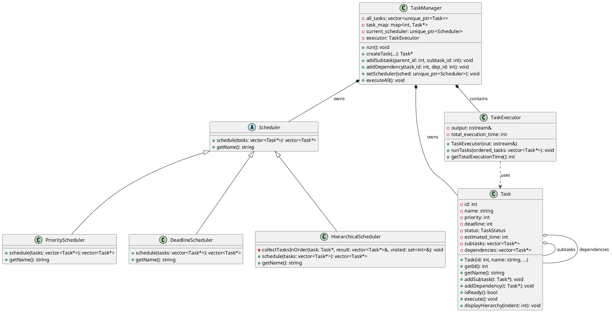

# HTSE Class Diagram (Text-Based)

## Class Hierarchy Overview

```
                        ┌──────────────┐
                        │   Scheduler  │ (Abstract)
                        │              │
                        │ + schedule() │ (pure virtual)
                        │ + getName()  │ (pure virtual)
                        └──────┬───────┘
                               │
                ┌──────────────┼──────────────┐
                │              │              │
        ┌───────▼───────┐ ┌───▼────────┐ ┌──▼──────────────┐
        │   Priority    │ │  Deadline  │ │  Hierarchical   │
        │   Scheduler   │ │  Scheduler │ │   Scheduler     │
        │               │ │            │ │                 │
        │ + schedule()  │ │+ schedule()│ │ + schedule()    │
        │ + getName()   │ │+ getName() │ │ + getName()     │
        └───────────────┘ └────────────┘ └─────────────────┘

```

## Composition Relationships

```
        ┌──────────────────┐
        │   TaskManager    │ owns
        │                  │◆────────┐
        │ - all_tasks      │         │
        │ - task_map       │         │
        │ - scheduler      │◆────────┼─────────┐
        │ - executor       │◆────┐   │         │
        └──────────────────┘     │   │         │
                                 │   │         │
                    ┌────────────▼┐  │    ┌────▼──────┐
                    │TaskExecutor │  │    │ Scheduler │
                    │             │  │    └───────────┘
                    │- output     │  │
                    │+ runTasks() │  │
                    └─────────────┘  │
                                     │
                                ┌────▼─────┐
                                │   Task   │
                                │          │
                                │ - id     │
                                │ - name   │
                                │ - subtasks   │◆─────┐
                                │ - dependencies│──────┼──→ references
                                │              │      │
                                │+ execute()   │      │
                                │+ isReady()   │      │
                                └──────────────┘      │
                                       │              │
                                       └──────────────┘
                                     contains/refers to
```

## Class Details

### Task

```
┌─────────────────────────────────────────┐
│              TASK                       │
├─────────────────────────────────────────┤
│ - id: int                               │
│ - name: string                          │
│ - priority: int                         │
│ - deadline: int                         │
│ - status: TaskStatus                    │
│ - estimated_time: int                   │
│ - subtasks: vector<Task*>               │ ◀── Composition
│ - dependencies: vector<Task*>           │ ◀── Aggregation
├─────────────────────────────────────────┤
│ + Task(id, name, priority, ...)         │
│ + getId(): int                          │
│ + getName(): string                     │
│ + getPriority(): int                    │
│ + getDeadline(): int                    │
│ + addSubtask(Task*)                     │
│ + addDependency(Task*)                  │
│ + isReady(): bool                       │
│ + execute()                             │
│ + displayHierarchy(indent)              │ ◀── Recursive
│ + getTotalSubtasks(): int               │ ◀── Recursive
└─────────────────────────────────────────┘
OOP: Encapsulation, Composition, Recursion
```

### Scheduler (Abstract)

```
┌─────────────────────────────────────────┐
│          SCHEDULER (Abstract)           │
├─────────────────────────────────────────┤
│ No data members                         │
├─────────────────────────────────────────┤
│ + schedule(tasks): vector<Task*> = 0    │ ◀── Pure Virtual
│ + getName(): string = 0                 │ ◀── Pure Virtual
│ + ~Scheduler() = default                │ ◀── Virtual Destructor
└─────────────────────────────────────────┘
OOP: Abstraction, Polymorphism
```

### PriorityScheduler

```
┌─────────────────────────────────────────┐
│        PRIORITY SCHEDULER               │
│           : Scheduler                   │ ◀── Inheritance
├─────────────────────────────────────────┤
│ No data members                         │
├─────────────────────────────────────────┤
│ + schedule(tasks): vector<Task*>        │ ◀── Override
│ + getName(): string                     │ ◀── Override
└─────────────────────────────────────────┘
Algorithm: Sort by priority (descending)
OOP: Inheritance, Polymorphism
```

### DeadlineScheduler

```
┌─────────────────────────────────────────┐
│        DEADLINE SCHEDULER               │
│           : Scheduler                   │ ◀── Inheritance
├─────────────────────────────────────────┤
│ No data members                         │
├─────────────────────────────────────────┤
│ + schedule(tasks): vector<Task*>        │ ◀── Override
│ + getName(): string                     │ ◀── Override
└─────────────────────────────────────────┘
Algorithm: Sort by deadline (ascending)
OOP: Inheritance, Polymorphism
```

### HierarchicalScheduler

```
┌─────────────────────────────────────────┐
│      HIERARCHICAL SCHEDULER             │
│           : Scheduler                   │ ◀── Inheritance
├─────────────────────────────────────────┤
│ - collectTasksInOrder(...): void        │ ◀── Recursive helper
├─────────────────────────────────────────┤
│ + schedule(tasks): vector<Task*>        │ ◀── Override
│ + getName(): string                     │ ◀── Override
└─────────────────────────────────────────┘
Algorithm: Parent before children (DFS)
OOP: Inheritance, Polymorphism, Recursion
```

### TaskExecutor

```
┌─────────────────────────────────────────┐
│          TASK EXECUTOR                  │
├─────────────────────────────────────────┤
│ - output: ostream&                      │ ◀── Composition
│ - total_execution_time: int             │
├─────────────────────────────────────────┤
│ + TaskExecutor(ostream&)                │
│ + runTasks(vector<Task*>)               │
│ + getTotalExecutionTime(): int          │
│ - executeTaskWithSubtasks(Task*, int)   │ ◀── Recursive
│ - printTaskExecution(...)               │
└─────────────────────────────────────────┘
OOP: Composition, Recursion
```

### TaskManager

```
┌─────────────────────────────────────────┐
│          TASK MANAGER                   │
├─────────────────────────────────────────┤
│ - all_tasks: vector<unique_ptr<Task>>   │ ◀── Owns tasks
│ - task_map: map<int, Task*>             │
│ - current_scheduler: unique_ptr<Sched>  │ ◀── Polymorphic
│ - executor: TaskExecutor                │ ◀── Composition
│ - next_task_id: int                     │
│ - completed_tasks: int                  │
│ - total_simulated_time: int             │
├─────────────────────────────────────────┤
│ + TaskManager()                         │
│ + run()                                 │ ◀── Main CLI loop
│ + createTask(...): Task*                │
│ + addSubtask(parent_id, subtask_id)     │
│ + addDependency(task_id, dep_id)        │
│ + setScheduler(unique_ptr<Scheduler>)   │ ◀── Polymorphic
│ + executeAll()                          │
│ - detectCycle(...): bool                │ ◀── Recursive DFS
│ - hasCircularDependencies(): bool       │
│ - displayMenu()                         │
│ - displayTaskHierarchy()                │
└─────────────────────────────────────────┘
OOP: Encapsulation, Composition, Polymorphism
```

## Interaction Flow

```
┌─────┐     ┌──────────────┐     ┌───────────┐     ┌──────┐
│User │────▶│ TaskManager  │────▶│ Scheduler │────▶│ Task │
└─────┘     │              │     │           │     └──────┘
            │  - creates   │     │ - orders  │
            │  - manages   │     │ - sorts   │
            │  - executes  │     │           │
            └──────┬───────┘     └───────────┘
                   │
                   ▼
            ┌──────────────┐
            │TaskExecutor  │
            │              │
            │ - simulates  │
            │ - reports    │
            └──────────────┘
```

## OOP Concepts Summary

| Concept       | Where Demonstrated                         |
| ------------- | ------------------------------------------ |
| Encapsulation | Task (private members), TaskManager        |
| Inheritance   | Scheduler → Priority/Deadline/Hierarchical |
| Abstraction   | Scheduler (abstract base class)            |
| Polymorphism  | Scheduler pointer, virtual functions       |
| Composition   | Task contains subtasks, Manager owns tasks |
| Aggregation   | Task references dependencies               |
| Recursion     | displayHierarchy, getTotalSubtasks, DFS    |

## Design Patterns

| Pattern    | Implementation                           |
| ---------- | ---------------------------------------- |
| Strategy   | Interchangeable Scheduler algorithms     |
| Composite  | Task hierarchy with recursive operations |
| Template   | Virtual functions in Scheduler           |
| Dependency | TaskExecutor accepts output stream       |

---

**Note**: This is a text-based representation. For graphical UML diagrams,
use tools like draw.io, Lucidchart, or PlantUML with this structure as reference.

## PlantUML Code (for automatic diagram generation)



Save the PlantUML code above to a `.puml` file and render it with PlantUML
for a graphical UML class diagram.
